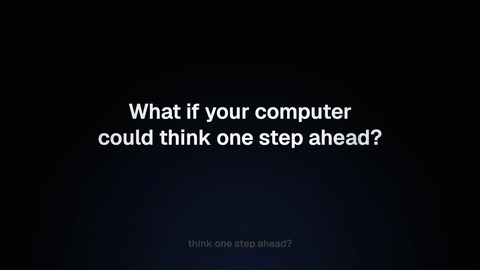
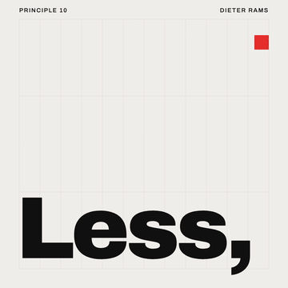
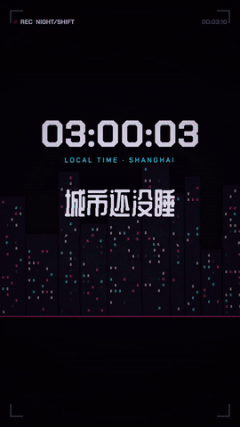

# canvas-video

**Describe a video, get a motion-designed MP4.** canvas-video is an agent skill for Claude Code and other coding agents. The agent asks you a few sharp questions, shows you style frames, writes the storyboard, and then designs every frame in HTML Canvas. It renders them frame-exactly and adds free Edge TTS narration and subtitles when you want them.

[中文说明 →](README.zh-CN.md)

<p align="center">
  
  
</p>

- **Canvas, deterministic.** Each frame is `draw(ctx, t)`, a pure function of time. It renders in parallel headless Chromium pages, is encoded with ffmpeg (H.264, BT.709) and comes out frame-exact.
- **The voice is the clock.** Microsoft Edge neural voices (free, no API key, 300+ voices, strong Chinese) with **word-level timestamps**. Scene lengths come from the speech, and visuals land on the words (`s.when('forty')`).
- **Subtitles done properly.** Cues are built from the same word timings. CJK line breaking follows kinsoku rules, and long lines split into balanced chunks. Captions are burned in with the video's own typography (or karaoke-highlighted) and also exported as `.srt`, `.vtt` or a soft track.
- **Designed, not generated-looking.** Five distinct motion-design presets, plus a written motion-design guide covering easing, timing, hierarchy, camera, transitions and anti-patterns. The agent follows it and checks its own probe frames against it.
- **Asks before it builds.** 4–7 questions tailored to the video type. Each has three concrete options, one marked *recommended*, with the reason.
- **Verifies itself.** `cv check` reports duration, fps, the audio track, loudness, caption overlaps, and **A/V sync** (speech onsets vs caption onsets).
- **Free & open.** MIT. The stack is Node, Playwright (Apache-2.0), ffmpeg and edge-tts. It needs no Remotion license, no build step, and no account.

## Style gallery

Every example below was rendered by the skill's own CLI from the files in [`presets/`](presets/). The GIFs are short excerpts; click through for the full video with sound (compressed 720p). Full-quality 1080p renders can be reproduced with one command, or downloaded from the release assets.

| | |
|---|---|
| <br>**Launch Keynote** · 16:9 · 16 s · 🔊 EN narration (AndrewNeural) + captions<br>A dark stage, a hero object lit by a radial wave, specular sweeps, numbers counting on the word.<br>[▶ video](docs/media/launch-keynote.mp4) · [source](presets/launch-keynote/video.html) | <br>**Clear Explainer** · 16:9 · 20 s · 🔊 ZH narration (YunxiNeural) + captions<br>Warm paper, ink type, an equation assembling on the words, a compound-interest curve drawn in time.<br>[▶ video](docs/media/clear-explainer.mp4) · [source](presets/clear-explainer/video.html) |
| <br>**Paper Sketch** · 16:9 · 16 s · 🔊 ZH narration (XiaoxiaoNeural) + captions<br>Hand-drawn strokes that "boil" on threes, watercolour washes, marker swipes, page-slide transitions.<br>[▶ video](docs/media/paper-sketch.mp4) · [source](presets/paper-sketch/video.html) | <br>**Swiss Kinetic** · 1:1 · 14 s · silent · motion blur<br>A 12-column grid, one red, snaps on a 100 BPM grid, a match cut (the square becomes the full stop).<br>[▶ video](docs/media/swiss-kinetic.mp4) · [source](presets/swiss-kinetic/video.html) |
| <br>**Neon Circuit** · 9:16 · 16 s · 🔊 ZH narration (YunjianNeural) + karaoke captions<br>Night city, HUD, RGB split fired only on hits, neon-tube flicker-on, a glitch cut.<br>[▶ video](docs/media/neon-circuit.mp4) · [source](presets/neon-circuit/video.html) | **Your style here**<br><br>During style discovery the agent always offers a *wildcard*: a custom system designed for your brief, previewed with your own title.<br><br>See [STYLE_PRESETS.md](STYLE_PRESETS.md). |

## How it works

```
 you: "make a 30-second video explaining compound interest"
   │
   ├─ 1. Questions ── 4–7 × three options (one recommended, with the reason)
   ├─ 2. Style frames ─ 3 directions rendered with your real title → you pick
   ├─ 3. Storyboard ── scene / voice line / focal point / sync word / transition
   ├─ 4. Build ─────── video.html (Canvas scenes) + narration.json
   │                    Edge TTS → word timings → scene lengths + caption cues
   │                    cv still --sheet → the agent reviews probe frames, fixes
   └─ 5. Render ────── N× headless Chromium → PNG → ffmpeg x264 segments → concat
                        voice clips (adelay/amix) → ducked music → loudnorm → AAC
                        → out/video.mp4 + .srt + .vtt → cv check (A/V sync, loudness…)
```

## Install

Requirements: **Node ≥ 18**, **ffmpeg** (with libx264) and **uv** (recommended) or Python with `pip install edge-tts`. Network access is needed for fonts and TTS.

### Claude Code

```bash
git clone https://github.com/<you>/canvas-video.git ~/.claude/skills/canvas-video
cd ~/.claude/skills/canvas-video && npm install
npx playwright install chromium        # only if you don't already have it
node scripts/cv.mjs doctor             # checks everything
```

Then just ask: *"Use canvas-video to make a 15-second launch teaser for …"* (or type `/canvas-video`).

### Other agents (Codex, Gemini CLI, Cursor, OpenCode, …)

Point the agent at this repo and ask it to follow `SKILL.md`. Everything is plain files plus one CLI: `node scripts/cv.mjs`.

## Usage

Things to try:

```text
Use canvas-video: a 20-second product teaser for "Halo", a smart desk lamp. Dark, premium, my brand color is #FF6A3D.
用 canvas-video 做一个 30 秒的知识讲解：为什么天空是蓝色的？要配音和字幕。
Make a 9:16 hype short for our hackathon on Oct 24 in Shanghai, with karaoke captions.
Kinetic typography of "Stay hungry, stay foolish", square, no voice.
```

### CLI

```bash
node scripts/cv.mjs doctor                         # environment check
node scripts/cv.mjs init my-video --preset clear-explainer [--ratio 9:16]
node scripts/cv.mjs tts my-video                   # Edge TTS → build/narration.js (cached)
node scripts/cv.mjs still my-video --sheet --subs  # probe frames + contact sheet for review
node scripts/cv.mjs render my-video --subs burn    # → my-video/out/my-video.mp4 (+ .srt/.vtt)
node scripts/cv.mjs check my-video/out/my-video.mp4 --srt my-video/out/my-video.srt
node scripts/cv.mjs gif my-video/out/my-video.mp4 --width 480
node scripts/cv.mjs voices --lang zh-CN
```

Render options: `--subs file|burn|soft|burn+soft|none` · `--music bed.mp3` (auto-ducked) · `--motion-blur 5` · `--scale 0.5` (draft) or `2` (4K) · `--from/--to` · `--workers` · `--format png|jpeg` · `--crf`.

Re-render every gallery example: `npm run examples`.

### A composition in 20 lines

```html
<script src="build/narration.js"></script>
<script src="canvas-video.js"></script>
<script>
const { ease, fx } = CV;
CV.create({
  width: 1920, height: 1080, fps: 30, background: '#050506',
  subtitles: { style: { box: 'rgba(0,0,0,.6)' } },
  scenes: [{
    id: 'hook',                       // narration.json segment "hook" drives its length
    draw(ctx, s) {
      ctx.font = '800 120px "Geist"'; ctx.fillStyle = '#fff'; ctx.textAlign = 'center';
      fx.lineReveal(ctx, ['Think ahead.'], s.W / 2, s.H / 2, s.t - s.when('Think'));
      ctx.fillStyle = '#4D7CFF';
      ctx.fillRect(s.W / 2 - 300, s.H / 2 + 60, 600 * s.at(s.when('ahead'), 0.6, ease.enter), 6);
    },
  }],
});
</script>
```

Open it in a browser for a live preview player (Space, ←/→, scrubbing, narration audio). See [docs/runtime-api.md](docs/runtime-api.md).

## Docs

- [SKILL.md](SKILL.md) — the agent workflow: questions, style discovery, storyboard, build, verify, deliver
- [STYLE_PRESETS.md](STYLE_PRESETS.md) — the five presets and how to design a custom one
- [docs/motion-design.md](docs/motion-design.md) — the motion-design guide (do/don't, timing tables, QA checklist)
- [docs/narration-and-subtitles.md](docs/narration-and-subtitles.md) — Edge TTS voices, writing for the ear, caption rules
- [docs/prompt-templates.md](docs/prompt-templates.md) — prompt patterns collected from X/GitHub (with sources) and ready-made templates
- [docs/tech-selection.md](docs/tech-selection.md) — why Canvas + Playwright + ffmpeg + Edge TTS (vs Remotion, HyperFrames, Motion Canvas, WebCodecs…)

## Credits

- Structure inspired by [zarazhangrui/frontend-slides](https://github.com/zarazhangrui/frontend-slides): show-don't-tell style discovery and anti-slop design rules, applied here to video.
- Narration by [rany2/edge-tts](https://github.com/rany2/edge-tts) (LGPLv3, used as an external tool) and Microsoft Edge's online TTS service. Check that the service terms fit your use.
- Rendering by [Playwright](https://playwright.dev) and [FFmpeg](https://ffmpeg.org). Fonts from [Google Fonts](https://fonts.google.com) (OFL).
- Prompt patterns credited in [docs/prompt-templates.md](docs/prompt-templates.md).

## License

[MIT](LICENSE) © 2026 Chris Han
