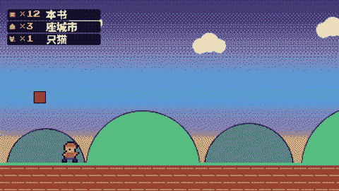
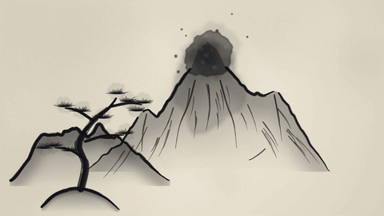
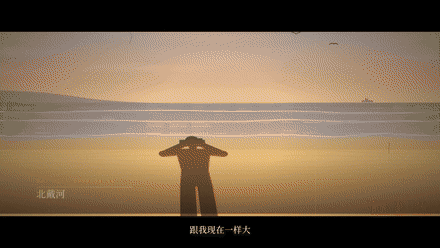

# video-gaga

**Describe a video, get a motion-designed MP4.** video-gaga is an agent skill for Claude Code and other coding agents. The agent asks you a few sharp questions, shows you style frames, writes the storyboard, and then designs every frame in HTML Canvas, or three.js when depth carries meaning. It renders them frame-exactly, scores them with generated music on the same beat grid as the cuts, and adds free Edge TTS narration and subtitles.

[中文说明 →](README.zh-CN.md)

<p align="center">
  
  
</p>

- **Canvas, deterministic.** Each frame is `draw(ctx, t)`, a pure function of time. It renders in parallel headless Chromium pages, is encoded with ffmpeg (H.264, BT.709) and comes out frame-exact.
- **The voice is the clock.** Microsoft Edge neural voices (free, no API key, 300+ voices, strong Chinese) with **word-level timestamps**. Scene lengths come from the speech, and visuals land on the words (`s.when('forty')`, or `fx.wordReveal({ sync: s })` for a headline that appears as it is said).
- **Music on the same beat.** Every video gets its own score, designed by the agent from the brief (tempo, key, mode, chords, instruments and how they build, within enforced limits; no preset styles) and arranged from the video's timeline. Cuts land on the beat, and every line starts on an eighth note. The bed dips under the voice, and its melody plays only in the pauses. Hits get a breath before them, and the last chord rings out with the final frame. Transitions whoosh and counters tick. All of it is synthesized locally and deterministically: no samples, no licences.
- **Room to breathe.** Narration is not wall-to-wall: music-only pre-rolls, held beats before the payoff, end cards that ring out (`beats: 6`, `narration: false`).
- **Real transitions and exits.** 22 transition types (whip, stripes, split, iris, ink, cube, light leak, …), each with its natural sound, plus exit choreography so cuts happen on action. A 3D bridge (`CV.three`) uses three.js for product turns, exploded views and globes, with deterministic WebGL.
- **Subtitles done properly.** Cues are built from the same word timings. CJK line breaking follows kinsoku rules, and long lines split into balanced chunks. Captions are burned in with the video's own typography (or karaoke-highlighted) and also exported as `.srt`, `.vtt` or a soft track.
- **Designed, not generated-looking.** Thirteen distinct motion-design presets, two of them in 3D, plus a written motion-design guide covering easing, timing, hierarchy, camera, transitions, sound and anti-patterns. The agent follows it and checks its own probe frames against it.
- **Asks before it builds.** 4–7 questions tailored to the video type. Each has three concrete options, one marked *recommended*, with the reason.
- **Verifies itself.** `cv check` reports duration, fps, the audio track, loudness, caption overlaps, **A/V sync** (speech onsets vs caption onsets, measured on the voice stem) and the **music/voice balance**. After a render it also checks that every voice clip starts where the timeline put it, including lines without a caption.
- **Free & open.** MIT. The stack is Node, Playwright (Apache-2.0), ffmpeg and edge-tts. It needs no Remotion license, no build step, and no account.

## Style gallery

Every example below was rendered by the skill's own CLI from the files in [`presets/`](presets/), music included. The GIFs are short excerpts; click through for the full video with sound (compressed 720p). Re-render them all with `npm run examples && npm run showcase`.

| | |
|---|---|
| <br>**Launch Keynote** · 16:9 · 24 s · 🔊 EN (AndrewNeural) · `keynote` score<br>A point of light opens the stage, the chip lights up on its spoken name (riser + one hit), specs count on the word, then a silent "thinking" beat match-cuts to the end card.<br>[▶ video](docs/media/launch-keynote.mp4) · [source](presets/launch-keynote/video.html) | <br>**Studio 3D** · 16:9 · 27 s · 🔊 EN (AndrewNeural) · `keynote` score · three.js<br>A fictional speaker on a seamless sweep: camera arrive-push and orbit, an exploded view where each layer lifts on its word, colour-ways swapping on the beat.<br>[▶ video](docs/media/studio-3d.mp4) · [source](presets/studio-3d/video.html) |
| <br>**Clear Explainer** · 16:9 · 26 s · 🔊 ZH (YunxiNeural) · `explainer` score<br>A 30-year ruler builds in the pre-roll, an equation assembles on the words, the camera follows a compound-interest curve, and an iris opens from the final value into a music-only beat.<br>[▶ video](docs/media/clear-explainer.mp4) · [source](presets/clear-explainer/video.html) | <br>**Blueprint** · 16:9 · 29 s · 🔊 EN (AndrewNeural) · `kinetic` score<br>A cyanotype drawing of a four-stroke engine builds itself, cuts into section, names its parts, then runs with real kinematics, one stroke per beat.<br>[▶ video](docs/media/blueprint.mp4) · [source](presets/blueprint/video.html) |
| <br>**Data Globe** · 16:9 · 26 s · 🔊 ZH (YunyangNeural) · `ambient` score · three.js<br>A dot-matrix globe turns to each airport as it is named; arcs draw from Atlanta, numbers count on the word, and a wordless ranking beat makes the gap the point (ACI 2023 data).<br>[▶ video](docs/media/data-globe.mp4) · [source](presets/data-globe/video.html) | <br>**Editorial** · 16:9 · 24 s · 🔊 EN (ChristopherNeural) · `documentary` score<br>The 1969 "LO" message as a magazine page: a masthead built over the pre-roll, a halftone map that prints, a teletype tape, a pull quote revealed word by word with the voice.<br>[▶ video](docs/media/editorial.mp4) · [source](presets/editorial/video.html) |
| <br>**Paper Sketch** · 16:9 · 24 s · 🔊 ZH (XiaoxiaoNeural) · `acoustic` score<br>Hand-drawn strokes that "boil" on threes, watercolour washes, page slides with a paper sound, a music-only bar where the drawing closes its loop.<br>[▶ video](docs/media/paper-sketch.mp4) · [source](presets/paper-sketch/video.html) | <br>**Swiss Kinetic** · 1:1 · 15 s · music only · `kinetic` score · motion blur<br>A 12-column grid, one red, every move on a 104 BPM beat, a 12-strip blinds cut, and a match cut where the square becomes the full stop.<br>[▶ video](docs/media/swiss-kinetic.mp4) · [source](presets/swiss-kinetic/video.html) |
| <br>**Neon Circuit** · 9:16 · 18 s · 🔊 ZH (YunjianNeural) · `synthwave` score<br>Night city and HUD, an RGB split only on hits, a terminal with a beat-blinking caret, a music-only "countdown armed" beat, glitch cuts with glitch sounds.<br>[▶ video](docs/media/neon-circuit.mp4) · [source](presets/neon-circuit/video.html) | <br>**Pop Collage** · 9:16 · 20 s · 🔊 ZH (XiaoyiNeural) · `pop` score<br>Cut-paper stickers that land on the beat with springs, palette-coloured stripe transitions, karaoke captions, a music-only recap where three tips land one per beat.<br>[▶ video](docs/media/pop-collage.mp4) · [source](presets/pop-collage/video.html) |
| <br>**Pixel Retro** · 16:9 · 34 s · 🔊 ZH (YunxiaNeural) · `chiptune` score<br>An 8-bit game played straight: every frame is painted on a 384×216 grid locked to 12 colours, the year drops in as blocks, a side-scroller hits three ? blocks as their numbers are said, a boss falls in four spoken hits, then a music-only LEVEL UP.<br>[▶ video](docs/media/pixel-retro.mp4) · [source](presets/pixel-retro/video.html) | <br>**Ink Wash** · 16:9 · 36 s · 🔊 ZH (XiaoxiaoNeural) · zither score<br>Ink blooms into rice paper, three ridges wash in only across the left third, calligraphy soaks in column by column as it is spoken, mist swallows the words, and a cinnabar seal lands on the beat.<br>[▶ video](docs/media/ink-wash.mp4) · [source](presets/ink-wash/video.html) |
| <br>**Cinematic Film** · 2.39:1 in 16:9 · 45 s · 🔊 ZH (YunyangNeural, YunjianNeural for the quote) · 72 BPM D major score<br>A documentary on film stock: a countdown leader, a river city before dawn on slow dollies, windows lighting on the half-beats, a film burn into sunrise, a rack focus to a line heard in the ferryman's own voice, a title that tracks open as it holds.<br>[▶ video](docs/media/cinematic-film.mp4) · [source](presets/cinematic-film/video.html) | |

During style discovery the agent also offers a *wildcard*: a custom system designed for your brief, previewed with your own title. A preset only sets the look and the motion grammar (palette, type, motion helpers, transitions, caption style). The script, the scene structure, the choreography and the music are designed for each video, and `cv init` copies the style, never the example's content. See [STYLE_PRESETS.md](STYLE_PRESETS.md).

### Longer videos

The presets show 15–30 s pieces. [`examples/hundred-days`](examples/hundred-days/video.html) is a 2.5-minute personal story in the Paper Sketch style (26 scenes in six chapters, narrated in Chinese by YunxiNeural): a chapter tag in the corner, music-only breaths between chapters, a score whose harmony changes per chapter (`music.parts`), and a callback from the first scene to the last. SKILL.md's *Long videos* notes cover planning one. [▶ video](docs/media/hundred-days.mp4)

## How it works

```
 you: "make a 30-second video explaining compound interest"
   │
   ├─ 1. Questions ── 4–7 × three options (one recommended, with the reason)
   ├─ 2. Style frames ─ 3 directions rendered with your real title, side by side on one
   │                    moodboard page (motion, palette, type, music direction) → you pick
   ├─ 3. Storyboard ── scene / voice line (or music only) / focal point / sync word /
   │                    exit / transition / music energy · sfx
   ├─ 4. Build ─────── video.html (Canvas or three.js scenes) + narration.json
   │                    Edge TTS → word timings → scene lengths + caption cues
   │                    beat grid → cuts and voice onsets snapped to the music
   │                    cv music → a score arranged from the timeline (+ sfx)
   │                    cv still --sheet → the agent reviews probe frames, fixes
   └─ 5. Render ────── N× headless Chromium → PNG → ffmpeg x264 segments → concat
                        voice clips (adelay/amix) + score → loudnorm → AAC
                        → out/video.mp4 + .srt + .vtt → cv check (sync, balance, loudness…)
```

## Install

Requirements: **Node ≥ 18**, **ffmpeg** (with libx264) and **uv** (recommended) or Python with `pip install edge-tts`. Network access is needed for fonts and TTS.

### Claude Code

```bash
git clone https://github.com/chrishan17/video-gaga.git ~/.claude/skills/video-gaga
cd ~/.claude/skills/video-gaga && npm install
npx playwright install chromium        # only if you don't already have it
node scripts/cv.mjs doctor             # checks everything
```

Then just ask: *"Use video-gaga to make a 15-second launch teaser for …"* (or type `/video-gaga`).

### Other agents (Codex, Gemini CLI, Cursor, OpenCode, …)

Point the agent at this repo and ask it to follow `SKILL.md`. Everything is plain files plus one CLI: `node scripts/cv.mjs`.

## Usage

Things to try:

```text
Use video-gaga: a 20-second product teaser for "Halo", a smart desk lamp. Dark, premium, my brand color is #FF6A3D.
用 video-gaga 做一个 30 秒的知识讲解：为什么天空是蓝色的？要配音和字幕。
Make a 9:16 hype short for our hackathon on Oct 24 in Shanghai, with karaoke captions.
Kinetic typography of "Stay hungry, stay foolish", square, no voice.
```

### CLI

```bash
node scripts/cv.mjs doctor                         # environment check
node scripts/cv.mjs init my-video --preset clear-explainer [--ratio 9:16]
node scripts/cv.mjs tts my-video                   # Edge TTS → build/narration.js (cached)
node scripts/cv.mjs music my-video                 # the generated score → build/music.wav (the preview plays it)
node scripts/cv.mjs still my-video --sheet --subs  # probe frames + contact sheet for review
node scripts/cv.mjs moodboard .cv-previews/style-a .cv-previews/style-b .cv-previews/style-c --wait  # pick a style on one page
node scripts/cv.mjs render my-video --subs burn    # → my-video/out/my-video.mp4 (+ .srt/.vtt)
node scripts/cv.mjs check my-video/out/my-video.mp4 --srt my-video/out/my-video.srt
node scripts/cv.mjs gif my-video/out/my-video.mp4 --width 480
node scripts/cv.mjs voices --lang zh-CN
```

Render options: `--subs file|burn|soft|burn+soft|none` · `--music track.mp3` (a licensed track instead of the score, side-chain ducked) · `--no-music` · `--motion-blur 5` · `--scale 0.5` (draft) or `2` (4K) · `--from/--to` · `--workers` · `--format png|jpeg` · `--crf`.

Re-render every gallery example: `npm run examples`, then `npm run showcase` for the GIFs and posters.

### A composition in 20 lines

```html
<script src="build/narration.js"></script>
<script src="video-gaga.js"></script>
<script>
const { ease, fx } = CV;
CV.create({
  width: 1920, height: 1080, fps: 30, background: '#050506',
  music: {                                    // a score designed for this video + the beat grid
    bpm: 92, key: 'A', mode: 'minor', progression: [0, 5, 2, 6],
    layers: [
      { inst: 'pad', pattern: 'X---', vel: 0.1 },
      { inst: 'bass', synth: true, octave: -1, pattern: 'XxXxXxXx', vel: 0.2, from: 0.3 },
      { inst: 'kick', pattern: 'X.........x.....', vel: 0.55, from: 0.55 },
    ],
  },
  subtitles: { style: { box: 'rgba(0,0,0,.6)' } },
  scenes: [{
    id: 'hook', voiceDelay: 1.3, energy: 0.4, // narration.json "hook" drives its length; a beat of music first
    draw(ctx, s) {
      ctx.font = '800 120px "Geist"'; ctx.fillStyle = '#fff';
      fx.wordReveal(ctx, 'Think ahead.', s.W / 2, s.H / 2, s.t, { sync: s, align: 'center', exit: s.out(0.4) });
      ctx.fillStyle = '#4D7CFF';
      ctx.fillRect(s.W / 2 - 300, s.H / 2 + 60, 600 * s.at(s.when('ahead'), 0.6, ease.enter), 6);
    },
  }],
});
</script>
```

Open it in a browser for a live preview player (Space, ←/→, scrubbing, narration audio). See [docs/runtime-api.md](docs/runtime-api.md).

## Docs

- [SKILL.md](SKILL.md) — the agent workflow: questions, style discovery, storyboard, build, verify, deliver
- [STYLE_PRESETS.md](STYLE_PRESETS.md) — the thirteen presets and how to design a custom one
- [docs/motion-design.md](docs/motion-design.md) — the motion-design guide (do/don't, timing tables, QA checklist)
- [docs/narration-and-subtitles.md](docs/narration-and-subtitles.md) — Edge TTS voices, writing for the ear, caption rules
- [docs/music-and-sound.md](docs/music-and-sound.md) — designing the score (spec, rules, limits), the beat grid, sound effects, pacing and silence
- [docs/three-d.md](docs/three-d.md) — three.js in a composition: when 3D earns its place, the pattern, the rules
- [docs/prompt-templates.md](docs/prompt-templates.md) — prompt patterns collected from X/GitHub (with sources) and ready-made templates
- [docs/tech-selection.md](docs/tech-selection.md) — why Canvas + Playwright + ffmpeg + Edge TTS + a seeded synth + three.js (vs Remotion, HyperFrames, Motion Canvas, WebCodecs…)

## Credits

- Structure inspired by [zarazhangrui/frontend-slides](https://github.com/zarazhangrui/frontend-slides): show-don't-tell style discovery and anti-slop design rules, applied here to video.
- Narration by [rany2/edge-tts](https://github.com/rany2/edge-tts) (LGPLv3, used as an external tool) and Microsoft Edge's online TTS service. Check that the service terms fit your use.
- Rendering by [Playwright](https://playwright.dev) and [FFmpeg](https://ffmpeg.org). 3D by [three.js](https://threejs.org) (MIT, loaded from a pinned CDN by compositions that use it). Fonts from [Google Fonts](https://fonts.google.com) (OFL).
- Prompt patterns credited in [docs/prompt-templates.md](docs/prompt-templates.md).

## License

[MIT](LICENSE) © 2026 Chris Han
