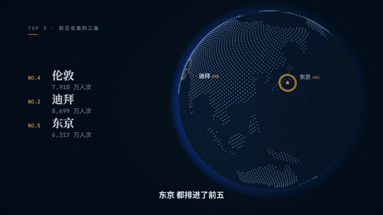
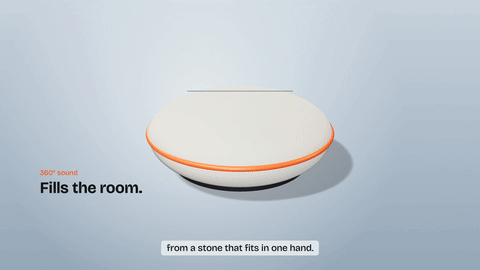
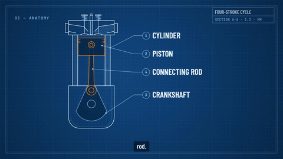
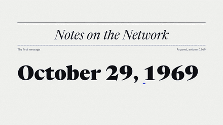

# video-gaga

**说出你想要的视频，得到一支有动效设计水准的 MP4。** video-gaga 是一个给 Claude Code 和其他编码 Agent 用的 skill。Agent 会先问几个关键问题，给你看风格样帧，写好分镜，然后用 HTML Canvas（需要立体感时用 three.js）设计每一帧并逐帧精确渲染。它会配上和剪辑同一个节拍网格的背景音乐、音效，以及免费的 Edge TTS 旁白和字幕。

[English →](README.md)

<p align="center">
  
  
</p>

- **Canvas 逐帧确定性渲染**：每一帧都是 `draw(ctx, t)` 这个纯函数的结果。多个无头 Chromium 页面并行渲染，再由 ffmpeg 编码为 H.264（BT.709），帧与帧之间不会有偏差。
- **配音决定时间轴**：用微软 Edge 神经语音，免费、不需要 API Key，300 多种音色，中文效果很好，而且带**词级时间戳**。场景时长由语音长度决定，画面在说到某个词时准确出现（`s.when('三十')`；标题也可以跟着读音逐词出现：`fx.wordReveal({ sync: s })`）。
- **音乐踩在同一个节拍上**：每支视频都有自己的配乐：Agent 根据需求现场设计（速度、调式、和弦、乐器以及它们如何随情绪叠加，均在强制限制之内，没有预设风格），再按这支视频的时间轴编排。剪辑点落在拍子上，每句旁白都从八分音符起拍。说话时音乐自动让位，旋律只在停顿里出现，重音前留半拍呼吸，最后一个和弦跟着末帧收尾。转场带风声，计数带滴答声。全部本地合成、可复现，不用采样，也没有版权问题。
- **节奏有张有弛**：旁白不必从头念到尾。纯音乐的开场、揭晓前的停顿、余韵充足的片尾（`beats: 6`、`narration: false`）都是设计的一部分。
- **真正的转场和退场**：22 种转场（甩镜、色带扫屏、开门、光圈、墨晕、立方体、漏光……），每种都有对应音效。元素会按编排退场，剪辑点落在动作上。另有 three.js 桥接（`CV.three`），可以做产品旋转、爆炸图、地球仪，WebGL 渲染同样逐帧确定。
- **字幕认真做**：字幕用同一份词级时间生成。中文断行遵守避头尾规则，长句按意群均衡切分，中文字幕去掉逗号和句号、保留问号和感叹号。字幕可以按视频自己的字体样式烧进画面，也可以做卡拉 OK 高亮，同时导出 `.srt`、`.vtt` 或 MP4 软字幕轨。
- **像设计出来的，不像 AI 生成的**：内置 10 套差异明显的动效风格预设（其中 2 套是 3D），并配有一份成文的动效设计规范，涵盖缓动、时长、层级、镜头、转场、声音和反模式。Agent 会按规范做，并对照规范自查样帧。
- **先问再做**：按视频类型提 4–7 个问题。每题固定三个具体选项，其中一个标注"推荐"并写明理由。
- **自己验收**：`cv check` 会核对时长、帧率、音轨、响度、字幕是否重叠、**音画同步**（在人声分轨上检测语音起点，再与字幕起点比对），以及**音乐与人声的音量比例**。渲染后还会逐条核对每段配音是否落在时间线上的位置，没有字幕的配音也会检查。
- **免费开源**：MIT 许可。依赖 Node、Playwright（Apache-2.0）、ffmpeg 和 edge-tts。不需要 Remotion 公司授权，不需要构建步骤，也不需要注册账号。

## 风格画廊

下面每个示例（包括配乐）都由本 skill 的 CLI 从 [`presets/`](presets/) 里的文件渲染而成。GIF 只截取片段，点"视频"可以看带声音的完整版（压缩后的 720p）。用 `npm run examples && npm run showcase` 可以全部重新生成。

| 风格 | 说明 |
|---|---|
|  | **Launch Keynote 科技发布会** · 16:9 · 24 秒 · 英文旁白 · `keynote` 配乐。一点光拉开舞台，芯片在被念出名字时点亮（铺垫音 + 一次重击），参数随读音滚动，一个无声的"思考"节拍匹配剪辑到片尾。[▶ 视频](docs/media/launch-keynote.mp4) · [源码](presets/launch-keynote/video.html) |
|  | **Studio 3D 产品棚拍** · 16:9 · 27 秒 · 英文旁白 · `keynote` 配乐 · three.js。无缝背景上的虚构音箱：镜头推近、环绕，爆炸图里每一层随读音升起，配色在拍子上切换。[▶ 视频](docs/media/studio-3d.mp4) · [源码](presets/studio-3d/video.html) |
|  | **Clear Explainer 知识讲解 / 信息图** · 16:9 · 26 秒 · 中文旁白（云希）· `explainer` 配乐。开场一小节音乐里铺出 30 年标尺，算式随旁白逐项拼出，镜头跟着复利曲线走，最后从终值处光圈展开进入一个纯音乐节拍。[▶ 视频](docs/media/clear-explainer.mp4) · [源码](presets/clear-explainer/video.html) |
|  | **Blueprint 工程蓝图** · 16:9 · 29 秒 · 英文旁白 · `kinetic` 配乐。四冲程发动机的蓝晒图自己画出来、剖开、标注零件，然后按真实运动学运转，一拍一个冲程。[▶ 视频](docs/media/blueprint.mp4) · [源码](presets/blueprint/video.html) |
|  | **Data Globe 数据地球** · 16:9 · 26 秒 · 中文旁白（云扬）· `ambient` 配乐 · three.js。点阵地球随读音转向每座机场，航线从亚特兰大画出，数字随读音滚动，一个无声的排名节拍把差距本身变成重点（ACI 2023 数据）。[▶ 视频](docs/media/data-globe.mp4) · [源码](presets/data-globe/video.html) |
|  | **Editorial 杂志纪实** · 16:9 · 24 秒 · 英文旁白 · `documentary` 配乐。用杂志版面讲 1969 年的 "LO"：前奏里逐字搭起刊头，网点地图逐行"印"出，电传纸带，引语随读音逐词浮现。[▶ 视频](docs/media/editorial.mp4) · [源码](presets/editorial/video.html) |
|  | **Paper Sketch 手绘纸感** · 16:9 · 24 秒 · 中文旁白（晓晓）· `acoustic` 配乐。按手绘顺序逐笔画线并每 3 帧抖动，水彩晕染，带纸张声的翻页转场，一小节纯音乐里画完整个循环。[▶ 视频](docs/media/paper-sketch.mp4) · [源码](presets/paper-sketch/video.html) |
|  | **Swiss Kinetic 极简排版** · 1:1 · 15 秒 · 纯音乐 · `kinetic` 配乐 · 运动模糊。12 栏网格、只用一种红色，每个动作都踩在 104 BPM 的拍子上，12 条百叶窗转场，红方块通过匹配剪辑变成句号。[▶ 视频](docs/media/swiss-kinetic.mp4) · [源码](presets/swiss-kinetic/video.html) |
|  | **Neon Circuit 赛博霓虹** · 9:16 竖屏 · 18 秒 · 中文旁白（云健）· `synthwave` 配乐。夜城与 HUD，RGB 分离只在命中点触发，终端光标随拍闪烁，一个纯音乐的"倒计时就绪"节拍，故障转场配故障音。[▶ 视频](docs/media/neon-circuit.mp4) · [源码](presets/neon-circuit/video.html) |
|  | **Pop Collage 波普拼贴** · 9:16 竖屏 · 20 秒 · 中文旁白（晓伊）· `pop` 配乐。剪纸贴纸踩着拍子弹入，品牌色带转场，卡拉 OK 字幕，纯音乐回顾里三条要点一拍一条落下。[▶ 视频](docs/media/pop-collage.mp4) · [源码](presets/pop-collage/video.html) |

选风格时，Agent 每次都会额外给一个"野卡"方案：专门为你的需求设计一套新风格，并用你的真实标题出样帧。预设只决定视觉风格和动效语法（配色、字体、动效函数、转场、字幕样式）；文案、场景结构、具体动画和配乐都按每支视频的需求重新设计，`cv init` 也只复制风格，不复制示例内容。详见 [STYLE_PRESETS.md](STYLE_PRESETS.md)。

### 更长的视频

预设示例都是 15–30 秒。[`examples/hundred-days`](examples/hundred-days/video.html) 是一支两分半的个人故事（Paper Sketch 风格，26 个场景、六个章节，云希中文旁白）：角落里有章节标记，章节之间留出纯音乐的停顿，配乐按章节换和声（`music.parts`），结尾呼应开头的第一个画面。规划长视频见 SKILL.md 的 *Long videos* 一节。[▶ 视频](docs/media/hundred-days.mp4)

## 工作流程

1. **提问**：4–7 个问题，每题三个选项，其中一个为推荐项并附理由。维度按视频类型挑选，例如时长、画幅、配音、字幕、品牌色、节奏、结尾。
2. **风格样帧**：用你的真实标题渲染 3 个方向（推荐预设、对比预设、定制野卡），由你挑选。
3. **分镜**：逐场景列出旁白原文（或标明纯音乐）、画面焦点、与哪个词或哪一拍同步、退场、转场、音乐能量和音效，确认后再动手。
4. **制作**：编写 `video.html`（Canvas 或 three.js 场景）和 `narration.json`。先跑 Edge TTS 拿到词级时间，剪辑点和起句对齐到节拍，`cv music` 按时间轴生成配乐，再生成探针样帧，由 Agent 自己看图挑问题、修改、再检查。
5. **渲染与验收**：并行渲染、混音（旁白、为人声让位的配乐、loudnorm 响度标准化）、封装，然后用 `cv check` 核对同步与音量比例，最后从成片里抽帧再看一遍。

## 安装

依赖：**Node ≥ 18**、**ffmpeg**（需带 libx264）、**uv**（推荐；或 `pip install edge-tts`）。字体和 TTS 需要联网。

```bash
git clone https://github.com/chrishan17/video-gaga.git ~/.claude/skills/video-gaga
cd ~/.claude/skills/video-gaga && npm install
npx playwright install chromium      # 本机已有浏览器可跳过
node scripts/cv.mjs doctor           # 环境自检
```

然后直接说：*"用 video-gaga 做一个 30 秒的视频，讲清楚复利"*。

其他 Agent（Codex、Gemini CLI、Cursor 等）：把仓库给它，让它按 `SKILL.md` 执行即可。

## 常用命令

```bash
node scripts/cv.mjs init my-video --preset clear-explainer [--ratio 9:16]
node scripts/cv.mjs tts my-video                    # 生成配音与词级时间（带缓存）
node scripts/cv.mjs music my-video                  # 生成配乐 build/music.wav（预览播放器会播放）
node scripts/cv.mjs still my-video --sheet --subs   # 探针样帧 + 缩略图拼版，供自检
node scripts/cv.mjs render my-video --subs burn     # 渲染 MP4，字幕烧录，同时导出 srt/vtt
node scripts/cv.mjs check my-video/out/my-video.mp4 --srt my-video/out/my-video.srt
node scripts/cv.mjs voices --lang zh-CN             # 列出中文音色
```

## 文档

- [SKILL.md](SKILL.md)：Agent 工作流（提问 → 风格 → 分镜 → 制作 → 验收 → 交付）
- [docs/motion-design.md](docs/motion-design.md)：动效设计规范（该做 / 不该做、时长表、自检清单）
- [docs/narration-and-subtitles.md](docs/narration-and-subtitles.md)：Edge TTS 音色推荐、为耳朵写稿、字幕规则
- [docs/music-and-sound.md](docs/music-and-sound.md)：如何设计配乐（规格、规则、限制）、节拍网格、音效、节奏与留白
- [docs/three-d.md](docs/three-d.md)：在作品里用 three.js：什么时候值得用 3D、写法和规则
- [docs/prompt-templates.md](docs/prompt-templates.md)：从 X / GitHub 收集的提示词模式（附出处）与现成模板
- [docs/tech-selection.md](docs/tech-selection.md)：技术选型（对比 Remotion、HyperFrames、Motion Canvas、WebCodecs 等）

## 致谢与许可

结构参考 [zarazhangrui/frontend-slides](https://github.com/zarazhangrui/frontend-slides)。3D 使用 [three.js](https://threejs.org)（MIT，由需要的作品从固定版本的 CDN 加载）。配音使用 [rany2/edge-tts](https://github.com/rany2/edge-tts)（LGPLv3，作为外部工具调用）和微软 Edge 在线 TTS 服务，请确认服务条款适合你的用途。渲染依赖 Playwright 与 FFmpeg，字体来自 Google Fonts（OFL）。

[MIT](LICENSE) © 2026 Chris Han
