# Style presets

Thirteen motion-design systems, each shipped as a working composition in `presets/<slug>/video.html` (with `narration.json` where voiced). A preset is a **visual style**: its palette and type (`THEME`), its reusable motion and drawing helpers (`KIT` sections), its transition vocabulary, caption style and pacing. Its example video (the `EXAMPLE` sections, the scenes, the narration and the score) only shows that grammar at work: `cv init` copies the style and leaves the example out, and each new video gets its own script, structure and score. **Read this index first. Read a preset's full `video.html` only after the user has picked it**, then treat that file as the design recipe: its palette, type, motion grammar, transitions and score. For a Phase 2 preview, read only its `THEME` object and first scene.

Every preset exposes a `THEME` / `T` object at the top (colours and fonts) so it can be re-branded without touching the motion code. Two presets use three.js for 3D (see [docs/three-d.md](docs/three-d.md)).

| Mood the user wants | Suggested presets |
|---|---|
| Impressed · premium · "launch" | Launch Keynote, Studio 3D, Swiss Kinetic |
| Understand · learn · trust the numbers | Clear Explainer, Blueprint, Data Globe |
| "Where in the world" · scale · global data | Data Globe |
| How a thing works · technical · precise | Blueprint, Studio 3D (exploded view) |
| Story · history · essay · gravitas | Editorial, Ink Wash, Cinematic Film |
| Calm · contemplative · Chinese culture and poetry | Ink Wash |
| Excited · hype · social | Pop Collage, Neon Circuit, Swiss Kinetic |
| Warm · friendly · human | Paper Sketch, Pop Collage, Clear Explainer |
| Bold · design-led · editorial | Swiss Kinetic, Editorial, Launch Keynote |
| Playful · nostalgic · gamified | Pixel Retro, Pop Collage |

| Preset | Format | Voice | Example's score | 3D |
|---|---|---|---|---|
| Launch Keynote | 16:9 | EN | `keynote` 92 | — |
| Studio 3D | 16:9 | EN | `keynote` 92 | three.js |
| Clear Explainer | 16:9 | ZH | `explainer` 100 | — |
| Blueprint | 16:9 | EN | `kinetic` 104 | — |
| Data Globe | 16:9 | ZH | `ambient` 80 | three.js |
| Editorial | 16:9 | EN | `documentary` 84 | — |
| Paper Sketch | 16:9 | ZH | `acoustic` 96 | — |
| Swiss Kinetic | 1:1 | none | `kinetic` 104 | — |
| Neon Circuit | 9:16 | ZH | `synthwave` 112 | — |
| Pop Collage | 9:16 | ZH | `pop` 116 | — |
| Pixel Retro | 16:9 | ZH | 108, E dorian → G major | — |
| Ink Wash | 16:9 | ZH | 80, E major | — |
| Cinematic Film | 16:9 (2.39:1 scope) | ZH | 72, D major | — |

---

## 1. Launch Keynote — `launch-keynote`

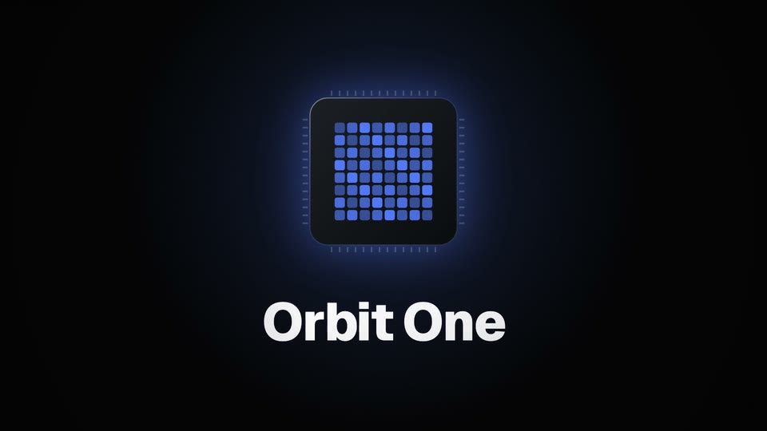

- **Vibe:** dark stage, one hero object, and light as the storyteller. Calm confidence.
- **Best for:** product launches, feature reveals, teasers, investor or event openers.
- **Avoid for:** playful or kids content, dense data.
- **Format:** 16:9 · 18–25 s · narration (EN: AndrewNeural −4%; ZH: YunyangNeural)
- **Palette:** `#050506` stage · `#F5F5F7` ink · `#86868B` dim · one accent `#4D7CFF` (swap for the brand)
- **Type:** Geist 600/800 display (tight tracking) · Geist Mono labels in tracked caps
- **Motion signature:** a point of light that opens into a hairline on the beat · the question revealed word by word as it is spoken · the stage splitting open along the hairline · the hero arriving dark and lighting up on its spoken name (radial core wave + halo flare) · specular sweeps across names and numbers · numbers counting on the word, earlier ones receding while each is spoken · a music-only "thinking" beat that match-cuts into the end card
- **Transitions:** split (along the hairline) into the reveal · push-up into specs · zoom-blur into the breath · hard match cut to the end card
- **Example's score:** `keynote` 92 BPM: one bar of pre-roll, a riser + the one `hit` on the product name, ticks on each spec, the final chord under the date
- **Captions:** small, boxed, low-contrast box
- **Pacing:** medium-slow. Hold the hero and let it breathe: pre-roll, ~1.5 s holds after each line, a 4-beat silent breath, a ~2 s end card.

## 2. Studio 3D — `studio-3d`

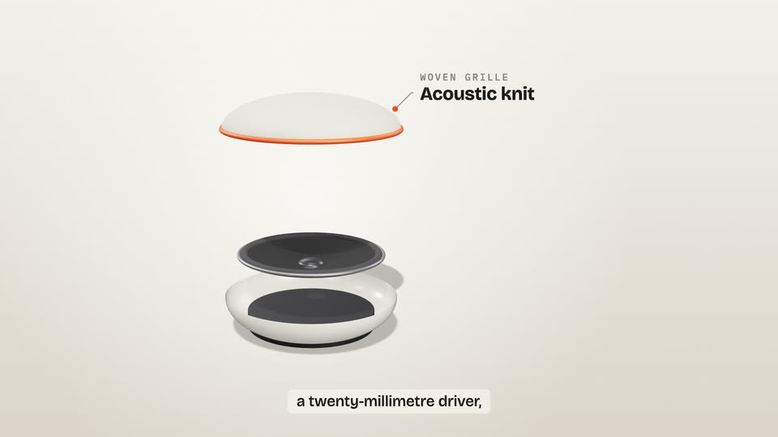

- **Vibe:** a light seamless studio sweep, one hero object, soft key and rim light. Quiet confidence, tactile.
- **Best for:** product and hardware launches, packaging, "what's inside" explainers, colour-way reveals: anything where turning the object or its layers carries meaning.
- **Avoid for:** abstract topics without an object, dense data, very long narration.
- **Format:** 16:9 · 20–30 s · narration (EN: AndrewNeural −4%; ZH: YunyangNeural) · **three.js**
- **Palette:** `#F3F0EA` → `#DCD5CA` sweep · `#1E1C1A` ink · `#857F76` dim · one accent `#FF5A1F` (swap for the brand) · colour-ways in a `COLOURWAYS` array
- **Type:** Bricolage Grotesque 800/700 display · IBM Plex Mono labels in tracked caps
- **Motion signature:** the light comes up and the camera arrives (arrive-push + orbit) · a slow orbit while features are named · sound ripples on the 3D floor · dimension lines and callouts tracked from projected 3D points · an **exploded view**, each layer lifting on its word · colour-ways swapping on the beat · light gliding across the finish in a music-only breath
- **3D:** three.js r186 via import map (`CV.three`), `RoomEnvironment` reflections, one shadowed key light on a `ShadowMaterial` floor, all poses set from `s.t` in one `pose()` function
- **Transitions:** camera-continuous cuts · `zoomBlur` into the exploded view · `flash` light leak to colour-ways and the end card
- **Example's score:** `keynote` 92 BPM: a riser + one hit on the name, ticks per layer, clicks per colour swap, a 4-beat breath before the end card
- **Captions:** bone box, ink text, 38 px
- **Pacing:** medium-slow. One idea per camera move; hold the object. 2D motion stays quiet while the camera moves.
- **Render tip:** a 3D frame costs ~4× a 2D frame; draft with `--scale 0.5 --format jpeg`.

## 3. Clear Explainer — `clear-explainer`

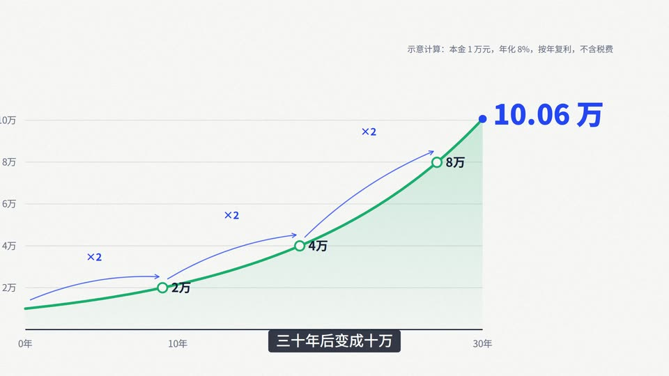

- **Vibe:** a well-edited explainer channel. Warm paper, ink type, functional colour.
- **Best for:** knowledge and science explainers, finance and data stories, how-it-works, onboarding, internal training.
- **Avoid for:** luxury and mood pieces.
- **Format:** 16:9 · 20–60 s · narration (ZH: YunxiNeural +6–10%; EN: AvaNeural)
- **Palette:** `#F3EFE6` paper · `#1D2433` ink · `#6B7180` muted · coral `#E4572E` = *the point* · teal `#1B998B` = *the evidence*
- **Type:** Noto Sans SC 900/700/500 · DM Mono for labels, axes and kickers
- **Motion signature:** a chapter progress bar · a kicker `01 / 04` that arrives on the first beat and leaves before the cut · a 30-year ruler laid down tick by tick during the music pre-roll, then filled in teal as "三十年" is spoken · headlines whose words land as they are said (`wordReveal` sync) · a highlighter pill growing behind the key term · an equation assembling term by term on the words, the answer rolling in like a counter · axes → grid → a curve drawn in time order, **the camera following the head of the line**, doubling markers popping with "×2" hops · an **iris that opens out of the final value** into a music-only beat where 1 万 counts up to 10.06 万
- **Transitions:** push-left (sequential chapters) · one iris from the payoff number
- **Example's score:** `explainer` 100 BPM, D major: one bar of pre-roll, energy 0.35 → 0.6, 0.8 in the breath, 0.45 at the end · ticks as the line passes each doubling, a pop on the answer, shimmer in the breath
- **Captions:** ink box, paper text, 42 px
- **Pacing:** steady. Every visual appears on the word that introduces it; one 6-beat breath before the takeaway.

## 4. Blueprint — `blueprint`

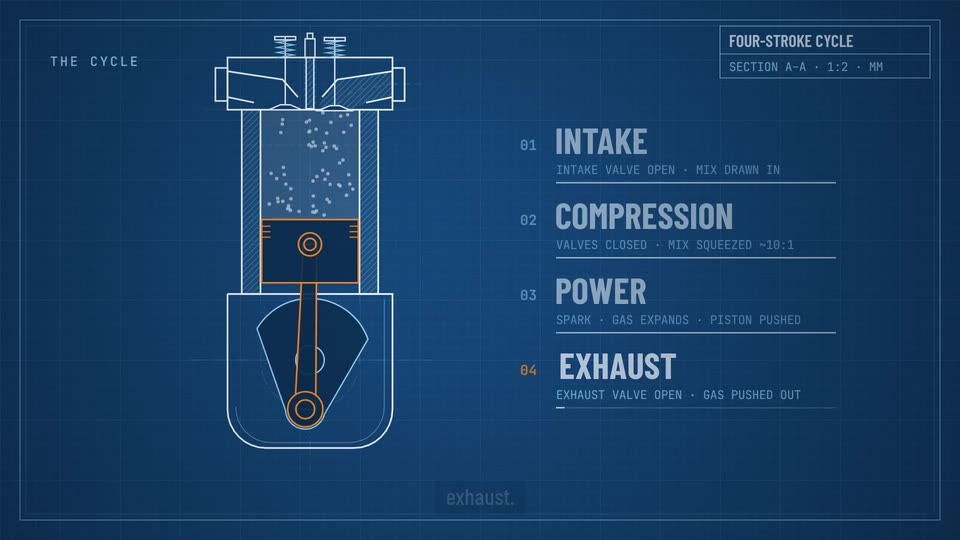

- **Vibe:** a cyanotype engineering drawing that builds itself, then runs. Precise, calm, quietly impressive.
- **Best for:** how-it-works, mechanisms, hardware and engineering explainers, architecture walkthroughs, technical onboarding.
- **Avoid for:** emotional or lifestyle stories, fashion, kids.
- **Format:** 16:9 · 20–30 s · narration (EN: AndrewNeural +0%; ZH: YunyangNeural)
- **Palette:** `#0D3A66` cyanotype field (radial to `#092B4F`, 24 px grid) · `#EAF4FF` object lines · `#8EC9F2` construction, dimensions and leaders · one signal `#FF8A1F` = the moving parts and the point
- **Type:** Barlow Condensed 700/600 display · JetBrains Mono 400–700 for labels, dimensions and the title block
- **Motion signature:** dash-dot construction lines laid down on the beat, then outlines drawn in a draftsman's order · a cutting-plane line that sweeps the outside view into a hatched section · numbered callouts that draw from the part to the label on the spoken word · dimension lines with arrowheads, values that count, and a phantom-line extreme position · **the mechanism animated with real kinematics** (a crank-slider, valves, spark), plus a live plot of the motion · camera pushes and pulls inside one continuous drawing
- **Transitions:** hard cuts on the beat within the one drawing · a `wipe` with a cyan `lineColor` to a new sheet
- **Example's score:** `kinetic` 104 BPM, E dorian. In the music-only run the mechanism is locked to the bar (one stroke per beat); clicks on construction beats, ticks on callouts and dimensions, a chime on the result
- **Captions:** Barlow Condensed 500, 46 px, on a deep-navy box
- **Pacing:** medium. Build, name, measure, then let it run without words.

## 5. Data Globe — `data-globe`

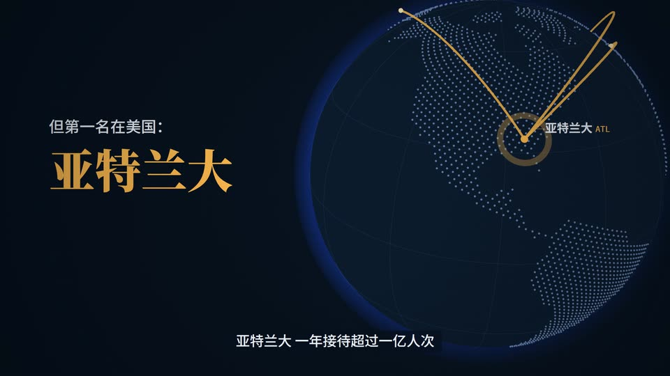

- **Vibe:** a night-time world map in motion. Calm, precise, cartographic; the data glows warm against a cool world.
- **Best for:** "where in the world" data stories, rankings across countries or cities, logistics, travel, trade, networks, global reports.
- **Avoid for:** single-location stories, playful or kids content, anything that needs dense text.
- **Format:** 16:9 · 20–30 s · narration (ZH: YunyangNeural; EN: ChristopherNeural or AvaNeural) · **three.js**
- **Palette:** `#06101D` navy field · `#0A1A2D` ocean · `#A7BEDA` land dots (the cool neutral) · `#2F4B70` graticule · amber `#FFB547` = *the data*, only
- **Type:** Noto Serif SC 900/700 (headlines, big numbers) · Noto Sans SC 500/700 (labels) · IBM Plex Mono (kickers, values, source)
- **Motion signature:** the globe arrives out of the dark, land dots revealing top→bottom · the globe **turns to each place as it is named** (shortest path, continuous across cuts) · markers pop with one expanding ring, the leader keeps a ring on every beat · great-circle arcs draw on with a bright head · 2D labels anchored to projected 3D points · numbers counting on the spoken word · a music-only ranking beat where the leader's bar lands a beat before the rest · travellers looping along the arcs, one lap per bar
- **Transitions:** beat-snapped hard cuts while the camera keeps moving (reads as continuous) · dissolve into and out of the data panel
- **Example's score:** `ambient` 80 BPM, energy rising 0.3 → 0.75 as the data accumulates; ticks per city, a swell on the answer, shimmer in the ranking beat, the final chord rings under the end card
- **Captions:** navy box, light text, 40 px
- **Pacing:** calm. One place per spoken name, every number held ≥ 1.5 s, one wordless beat for the ranking.
- **Data note:** the example uses ACI World 2023 airport passenger figures (on screen with source and calculation). Replace the data, keep the footnote.

## 6. Editorial — `editorial`

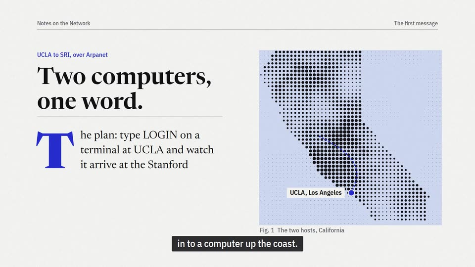

- **Vibe:** a well-made magazine page that reads itself aloud. Measured, literate, quietly dramatic.
- **Best for:** history and documentary essays, journalism, long-form explainers, culture and brand stories, annual-report narratives.
- **Avoid for:** hype, social shorts, dense numeric dashboards.
- **Format:** 16:9 · 20–30 s · narration (EN: ChristopherNeural +0%; ZH: YunyangNeural with Noto Serif SC)
- **Palette:** `#F2ECDF` newsprint · `#1A1916` ink · `#6E685C` muted · one editorial red `#C8322B` (the key word, the mark) · tape/block `#E8DFCC`
- **Type:** Fraunces 800/600 display + Fraunces italic for the masthead and pull quotes · IBM Plex Mono tracked caps for datelines, figures and footnotes · IBM Plex Sans Condensed captions
- **Motion signature:** hairline rules drawing on · a masthead built letter by letter over the music pre-roll · type set by masked line reveals on the voice · a red drop cap · a procedural duotone halftone that "prints" top to bottom · the camera riding a spring along a teletype tape · a pull quote with a hanging red quote mark, revealed word by word in sync with the voice · a red underline on the key word · footnote marks¹
- **Transitions:** an ink-edged wipe (page turn, paper sound) for sequential pages · a custom ink wash into and out of the dark "breath" page
- **Example's score:** `documentary` 84 BPM, D minor: a music-only masthead pre-roll, energy rising to the pivotal fact, one music-only breath before the conclusion, a 1.5–2 s ring-out · paper on page turns, ticks on dates, type strikes on typed letters, one hit on the turning point
- **Captions:** ink box, newsprint text, Plex Sans Condensed 40 px
- **Pacing:** measured. A hold after every fact; silence is part of the layout.

## 7. Paper Sketch — `paper-sketch`

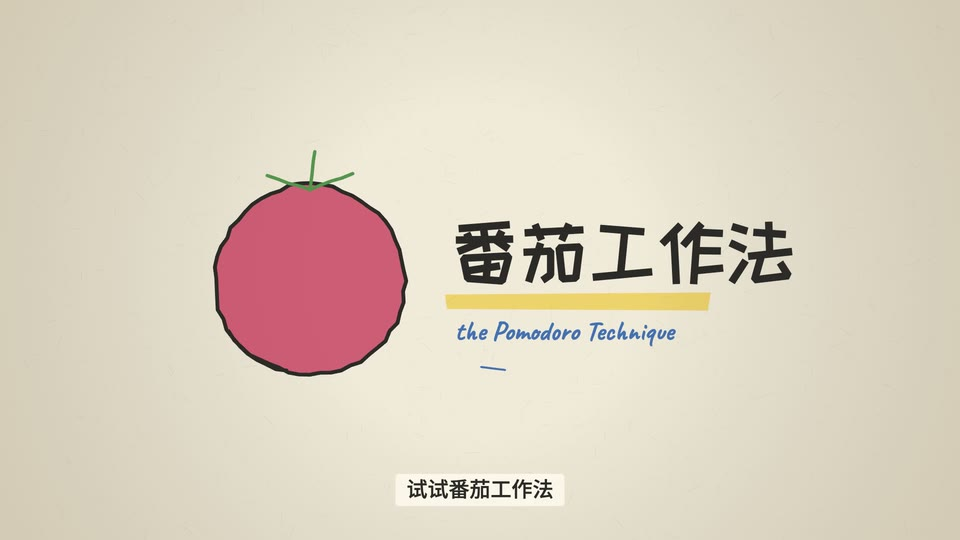

- **Vibe:** a friendly teacher drawing on paper. Warm, handmade, patient.
- **Best for:** education, habits and self-improvement, kids, onboarding, "how it works" for non-technical audiences, internal culture.
- **Avoid for:** premium tech launches, anything that must feel precise and corporate.
- **Format:** 16:9 · 15–25 s · narration (ZH: XiaoxiaoNeural +0–4%; EN: EmmaNeural)
- **Palette:** `#F1E9D8` paper (with fibre texture + edge vignette) · `#2B2A28` pencil ink · marker `rgba(255,216,77,.75)` (multiply) · watercolour red `#D1495B`, green `#4F8A4B`, blue `#3D6FB6`
- **Type:** ZCOOL KuaiLe (titles) · Long Cang (handwritten notes) · Caveat (Latin annotations) · Noto Sans SC captions
- **Motion signature:** the hand starts drawing on the first beat, before anyone speaks · strokes drawn in the order a hand would draw them · **boiling lines** (the jitter re-seeds every 3 frames, i.e. animated on threes) · lettering that lands character by character with the voice · watercolour washes fading in after the outline · a highlighter swipe under the key term · hand-drawn arrows with late arrowheads · a ringing bell with decaying rotation · notes that "clear the desk" before the next page · a music-only bar where the drawing closes its loop
- **Transitions:** a custom **page slide** (a new sheet slides over with a soft shadow, a slight rotation and a paper sound) · one **ink** bloom (faint watercolour edge) into the ending · a hard cut on the beat to continue on the same page
- **Example's score:** `acoustic` 96 BPM: fingerpicked strings, snaps and shaker, a glockenspiel melody in the gaps · energy 0.3 → 0.55, 0.7 in the music-only loop, 0.4 at the end · paper on slides, a click and a chime on their words, soft ticks per check mark, one shimmer payoff
- **Captions:** cream paper box, ink text
- **Pacing:** relaxed. One bar of music before the first word, draw on the word, hold each note ≥ 1 s, one music-only bar before the last line, a 1.5 s ring-out.

## 8. Swiss Kinetic — `swiss-kinetic`

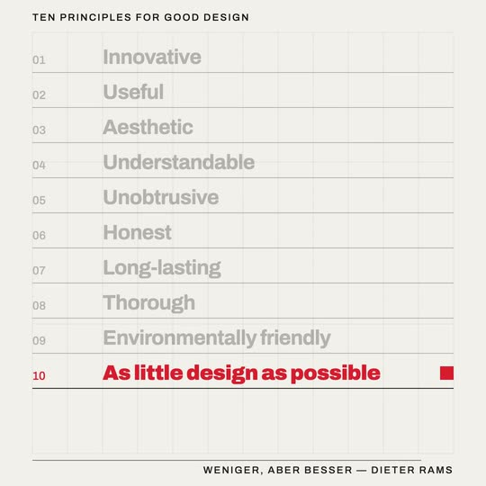

- **Vibe:** International Typographic Style in motion. Grid, one red, type as image.
- **Best for:** quotes, manifestos, brand principles, event titles, social squares, typographic intros.
- **Avoid for:** long narration, dense explanation.
- **Format:** 1:1 (also 16:9 and 9:16) · 12–16 s · usually no voice. The music is the clock.
- **Palette:** `#F2F0EB` paper · `#111111` ink · `#E62E2D` red (one red, always)
- **Type:** Archivo 900/700/500 · huge display sizes, negative tracking, tracked caps labels
- **Motion signature:** a 12-column grid drawing on · snap easing `bezier(.7,0,.1,1)` · a word slamming up from a mask on the beat and dropping back on the exit beat · an inverted field for contrast · tracking closing in on the key word · **match cut** (the red square becomes the full stop, then waits in the slot of the final principle while the ledger fills in above it) · a ledger row on every half-beat · hierarchy by subtraction (everything else recedes) · a beat-step hairline at the foot of the page
- **Transitions:** hard cuts on the beat · `blinds` with 12 strips (the grid's columns) at most once. No fades.
- **Example's score:** `kinetic` 104 BPM (marimba ostinato, four-on-the-floor, claps on 2 & 4). Scene lengths in `beats`, every move on `s.onBeat(i)`, energy building 0.35 → 0.8 · soft ticks per ledger row and one `hit` on the full stop
- **Captions:** none, or bottom-left in Archivo 500 caps
- **Pacing:** a 104 BPM beat grid (0.58 s); something happens on every beat or half-beat.
- **Render tip:** `--motion-blur 5` for the snaps.

## 9. Neon Circuit — `neon-circuit`

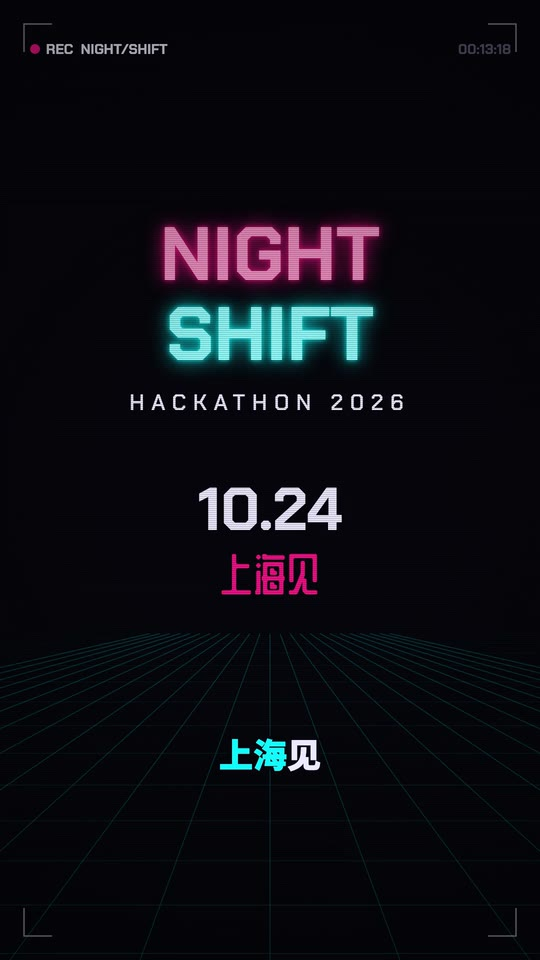

- **Vibe:** night city, CRT and HUD. Energy with discipline.
- **Best for:** hackathons, gaming, esports, dev tools, event promos, music drops. **Vertical social shorts.**
- **Avoid for:** finance, healthcare, calm or luxury.
- **Format:** 9:16 · 15–22 s · narration (ZH: YunjianNeural; EN: GuyNeural or BrianNeural +6%)
- **Palette:** `#07060D` ink-violet black · magenta `#FF2E88` = energy · cyan `#00E5FF` = information · `#EDEBFF` text · `#5B5875` dim
- **Type:** Chakra Petch 700/500 (Latin, numerals) · ZCOOL QingKe HuangYou (Chinese display) · Noto Sans SC 900 captions
- **Motion signature:** the hook on screen at frame 0 (a ticking clock, an RGB split on each second) · an RGB split that fires *on the hit* and decays within 6 frames · numerals slamming in on their words while earlier ones recede · a perspective floor grid moving with the beat · a seeded skyline with blinking windows · a terminal typewriter with a beat-blinking caret · a music-only "countdown armed" beat (digits decode, a charge bar fills per beat) · neon tubes coming on with two short dropouts · scanlines + HUD corners + a beat-synced REC dot + timecode
- **Transitions:** glitch (0.4 s, magenta tint) · one whip-up into the question
- **Example's score:** `synthwave` 112 BPM, F♯ minor: 16th saw bass, plucked arps, a big snare · glitch sounds on glitch cuts, clicks on the numbers, key bursts on the terminal, one hit on the question
- **Captions:** big (68 px), outlined, **karaoke highlight** in cyan, baseline at 80% height (clear of platform UI)
- **Pacing:** fast. A hit every 1–1.5 s, with one music-only beat before the CTA.

## 10. Pop Collage — `pop-collage`

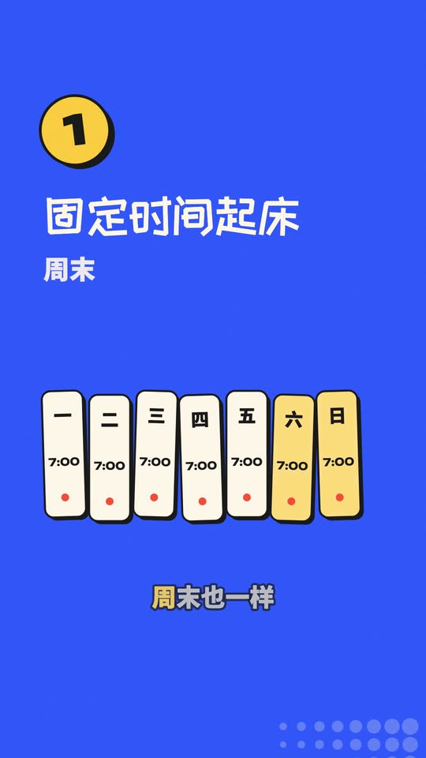

- **Vibe:** cut paper on flat primary colour. Playful, loud, and still tidy.
- **Best for:** social shorts (Reels/TikTok/Shorts/视频号), tips and how-tos, listicles, consumer brand promos, community and event teasers.
- **Avoid for:** luxury, serious or sensitive topics, dense data.
- **Format:** 9:16 · 12–20 s · narration (ZH: XiaoyiNeural +8–10%; EN: EmmaNeural +6%)
- **Palette:** `#FFC93C` yellow · `#FF5A36` red · `#2D5BFF` blue · `#FFF6E9` cream · `#1A1A1A` ink. Each scene owns one field colour.
- **Type:** ZCOOL KuaiLe (Chinese display) · Noto Sans SC 900 (strong body, captions) · Unbounded 900 (numerals, Latin)
- **Motion signature:** every shape is a sticker (ink outline + hard offset shadow) that lands on a beat with a snappy spring · words land as they are said (never bouncy) · a numbered badge on each tip's first beat · a flip-clock tick-over (6:59 → 7:00) · weekday cards in a fast stagger · halftone corners and squiggles drawing on · a music-only recap where three pills land one per beat · an arrow toward the platform's save button
- **Transitions:** palette `stripes` (red/cream/blue bands) between tips · one `whip` up into the recap
- **Example's score:** `pop` 116 BPM, C major: high energy, a dip on the last tip, one `hit` on the recap; pops and ticks on sticker landings, shimmer on the payoff
- **Captions:** big (62 px), cream with an ink stroke, **karaoke highlight** in yellow, baseline at 80% height
- **Pacing:** fast. A sticker lands on nearly every beat; `tail: 0.25` keeps ~0.5 s of air after each line.

## 11. Pixel Retro — `pixel-retro`

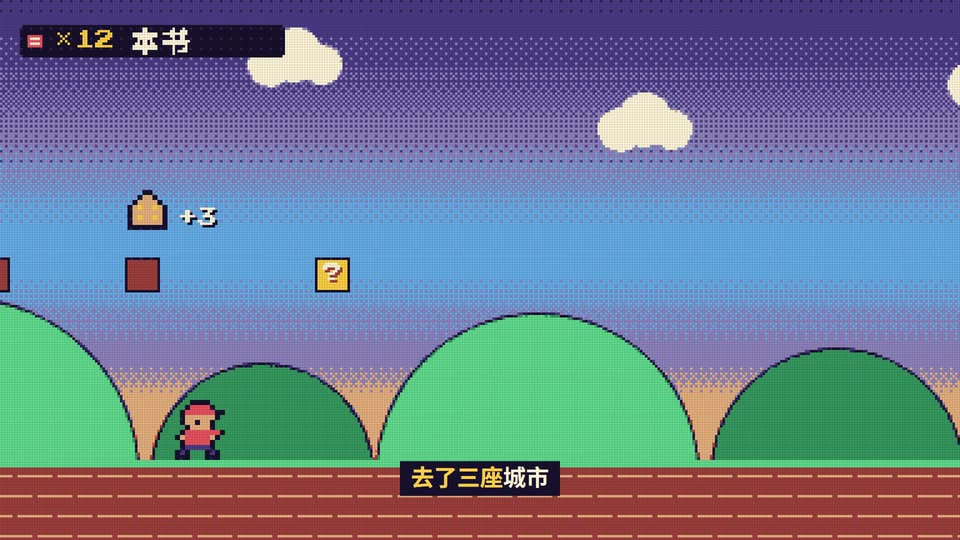

- **Vibe:** an 8-bit console game, played straight. Nostalgic and a little heroic, and it can carry a real feeling: every frame could be a screenshot.
- **Best for:** year-in-review and milestone videos, gaming and indie-dev content, gamified onboarding ("level up", quests, achievements), kids and community promos, playful product changelogs.
- **Avoid for:** luxury, finance and healthcare, serious or sensitive topics, dense data, anything that needs fine detail or photographic realism.
- **Format:** 16:9 (also 9:16 and 1:1) · 20–70 s · narration (ZH: YunxiNeural for a story, as in the example, or YunxiaNeural +4% for a cartoon voice; EN: GuyNeural) with burned captions in a game text box, or music only
- **Palette:** 12 colours and nothing else: `#16122B` night · `#2C2554` shade · `#4B3F86` dusk · `#8C85BD` dim · `#FFF3D6` ink · `#5FA8E8` sky · `#57C98A` mint · `#2E8A5C` leaf · gold `#FFC93C` = rewards and the point · coral `#F25F5C` = danger and the hero · `#A3473A` rust · `#E8B07A` sand
- **Type:** Press Start 2P (Latin, numerals, HUD) on its 8 px grid · Noto Sans SC 700 thresholded to 1-bit for Chinese (12 grid px minimum, 16 for titles)
- **The device:** `pixelFrame` paints each scene on a low-resolution buffer (one cell = 5 design px, 384×216 at 1080p), snaps every pixel to the palette (optionally with a 4×4 ordered dither, so gradients become dithered bands) and scales it up with nearest-neighbour sampling. Circles, gradients and rotated shapes drawn with the normal canvas API come out as pixel art. A faint LCD cell grid sits on top. Colour is a story device: `mono` drains the frame (or any region) to the five night→ink tones, `keep` lets one colour survive the drain, `reveal` + `inCircle` flood a second, full-colour world in through a dithered edge, and `zoom` punches the camera in so the cells themselves get bigger.
- **Motion signature:** everything moves in whole cells and quantised steps (`steps`, `jump`, `hop`), never eased glides · 16×24 character sprites animated on eighth notes (`sprite`, `cycle`) · hard pixel punch-ins on the key word (`zoom`) · RPG windows that open in four steps (`win`) · speech bubbles that pop out of their tail (`bubble`) and ellipses drawn as square dots (`dots`) · a dialogue box that types its line and blinks a ▼ on the beat (`dialogue`) · segmented meters for HP and EXP, hollow when empty (`meter`) · block type that lands column by column on sixteenths with a glint (`blockText`) · debris thrown by impacts, animated on twos (`debris`) · a jolt of a few whole-cell frames on impact (`jolt`) · parallax scrolls at whole-cell speeds
- **Transitions:** `tileWipe` (a staircase of tiles closes along the diagonal and opens on the next screen, with a swish) · the runtime's `pixelate` into a battle or a new level · hard cuts on the beat for payoffs
- **Example's score** (《隐藏关卡》, a short about finding your voice): 108 BPM, E dorian while the world is grey (a square-wave arp ticking like a clock over a felt piano, i–IV–i–VII), the relative G major from the moment the wall breaks (I–V–vi–IV), IV–V–I to land; synth bass, the electronic kit, brass stabs and a 16th square arp at the peak, a square lead in the gaps · ticks as the quest log checks off, a pop on the empty meter, the one `hit` when the wall breaks, shimmers as colour floods in and the meter fills, a riser into the bubble, a chime on 开始
- **Captions:** Noto Sans SC 700, 46 px, ink on a square night box (no radius), low at 0.9 H, like a game's text box
- **Pacing:** brisk and on the grid. Something reacts on every beat or half beat, text holds until it can be read at typing speed, and one music-only payoff gets a full bar.
- **Render tip:** keep the grid size (`T.px`) a divisor of both sides; at 9:16 the grid is 216×384. GIF exports want few colours (16) and no dithering of their own.

## 12. Ink Wash — `ink-wash`

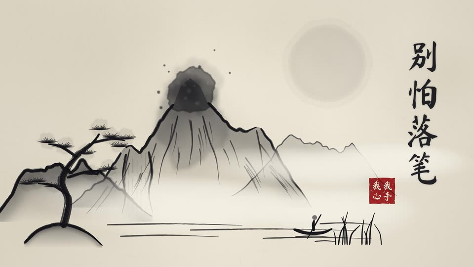

- **Vibe:** a Chinese ink painting (水墨) that paints itself on rice paper. Still, spacious, literate; the empty paper is part of the picture.
- **Best for:** Chinese culture, poetry and philosophy, tea, calligraphy and craft, festivals and the solar terms, brand stories with an Eastern voice, reflective essays and wellness.
- **Avoid for:** dense data, tech launches, hype and fast social cuts.
- **Format:** 16:9 · 30–90 s · a calm voice (ZH: XiaoxiaoNeural −6% as in the example, or YunyangNeural −6%; EN: ChristopherNeural) or music only
- **Palette:** `#EEE7D7` 宣纸 rice paper (fibres, cloudy sizing, a warm edge) · one cool ink `#141419` used at tones from 淡墨 0.15 to 浓墨 0.9 · `#F4EFE4` mist · one cinnabar `#B5342A`, kept for the single thing that matters most (the example: a teacher's red cross that comes back as the seal)
- **Type:** Ma Shan Zheng (brush 楷书 display, set in vertical columns read right to left) · Noto Serif SC 500/700 for small labels and captions
- **Motion signature:** a drop of ink **seeping** into the paper (`seep`: a feathered water front, mottled pools of dense ink, a darker wet edge, capillary threads creeping out along the fibres) · an ink drop **blooming**, paler inside with a darker wet edge · **brush strokes** that press in, run and lift, breaking into dry-brush bristles (飞白) at the tail · washes that soak in pale and settle, dark at the crest and fading into mist at the foot, with no banding (远山淡、近山浓) · a painted **brush** that comes down, sways to rest and lets a bead of ink fall · one painting that keeps growing across cuts while the camera travels over it (strokes timed in global seconds with `spokenAt` / `startOf`) · calligraphy that **soaks in** character by character, soft and slightly large, then sharp with a faint bleed · drifting **mist** that swallows what it passes, which is also how things exit · one **seal** pressed on the beat as the full stop
- **Transitions:** a custom **handscroll pan** (手卷: the next scene is the next stretch of the same scroll, the join hidden in mist, with a paper sound) · the runtime `ink` bloom with a faint ink edge into the ending · hard cuts on the beat when the painting stays and only the words change
- **Example's score:** 80 BPM, E major in four parts (vi–IV–I–V for the memory, IV–V held for the drop, I–V–vi–IV as the painting grows, IV–V–I–I home): a felt-piano figure and a music box for the childhood, then a koto line, strings, upright bass and a brushed kit, a bamboo-flute melody in the gaps · energy 0.24 at the stain, 0.9 in the music-only montage · two swishes for the red cross, a pop as the drop lands, one hit for the seal
- **Captions:** Noto Serif SC 500 44 px, ink with a paper-coloured outline, low (0.935 H), a paper box over busy pages; or `captions: 'file'` when the line is already on screen in calligraphy
- **Pacing:** washes and the camera are slow; strokes are quick and land on the beat. The picture comes first and the voice after it (`voiceDelay` of a few beats), each column soaking in on its spoken words, a music-only montage where a stroke lands on every beat, a long ring-out under the seal.

## 13. Cinematic Film — `cinematic-film`

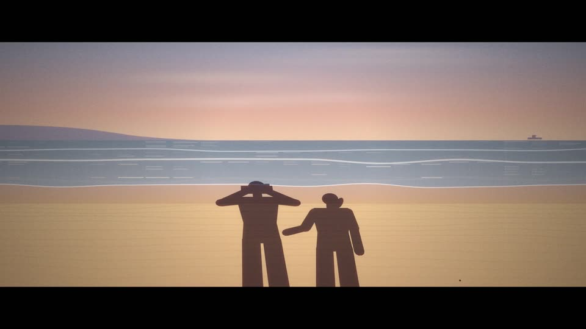

- **Vibe:** a documentary shot on film and projected in a dark room. Patient, warm, a little nostalgic.
- **Best for:** brand films and manifestos, documentary and memoir pieces, places and people, anniversaries, trailers and title sequences, anything that should feel *felt* rather than explained.
- **Avoid for:** dense data, fast social hooks, UI walkthroughs, anything that must read as crisp and digital.
- **Format:** 16:9 with a 2.39:1 scope letterbox (`T.aspect`; 1.85 for a flat frame) · 30–60 s · a slow documentary narration (ZH: YunyangNeural −6%, with a second voice for a quoted interviewee; EN: ChristopherNeural −4%) or music only. For 9:16, set `T.aspect` to 1 (no bars) and keep the gate.
- **Palette:** `#0B0A08` film black, lifted to `#121A1B` teal · `#F1E6D0` cream titles · one warm accent `#E3A257` (timecodes, the light) · `#8A7F70` dim · the grade is a warm soft-light `#FFB46E` with red-orange halation `#FF6A2A`
- **Type:** Noto Serif SC 500/600 (Chinese titles, supers) · Cormorant Garamond 500/600 (Latin titles in wide-tracked caps) · Courier Prime (timecodes and kickers)
- **Motion signature:** the **film gate** over every frame (`filmGate`: gate weave, halation, a warm grade with lifted blacks, exposure flicker, dust, hairs and a scratch that lives for a few dozen frames, vignette, grain) · scope **letterbox** bars · slow **dollies** on every shot (`dolly`: a push or a lateral track over the whole shot, never a snap) · titles that **fade up out of focus and keep tracking open** while they hold (`trackTitle`) · a documentary **lower third**: mono timecode kicker, a hairline that draws, a serif line that resolves glyph by glyph (`lowerThird`) · an academy **countdown leader** (`leader`) · rack focus by blurring a half-size buffer
- **Transitions:** long dissolves (`fade`, 1.4–1.8 s) by default · `dip` to black for chapter breaks · one custom **film burn** (`filmBurn`: the stock overexposes into orange and white and the next shot comes through) for the turn of the piece. No pushes, wipes or whips.
- **Example's score:** 72 BPM, D major from the relative minor (`[5, 3, 0, 4]`): a sine pad alone under the leader, low strings and a bass as the city wakes, felt-piano eighths at first light, a heartbeat tom only under the sunrise, a sparse keys melody in the gaps; the leader, the sunrise and the title card are music only · ticks on the countdown, swells on the dissolve and the burn, one shimmer when the sun clears
- **Captions:** in the lower letterbox bar like a film print's subtitles: Noto Serif SC 38 px cream with a thin dark stroke, no box
- **Pacing:** slow. The narrator sets the shot lengths (6–10 beats each, a long `tail` after each line), every title held long enough to read twice, a dip to black before the title, a long fade to black at the end.
- **Render tip:** the gate touches every pixel each frame, so draft with `--scale 0.5`; for the GIF use fewer frames and colours.

---

## Custom / wildcard styles

If none fits, design a custom system and offer it as the wildcard in Phase 2. It needs:
1. A **visual thesis** in one sentence ("a museum wall label that comes alive").
2. A committed palette (1 field, 1 accent, 1 neutral) and a type pairing (display + label). No Inter/Roboto/Arial defaults. Don't reach for purple gradients or neon-on-dark unless the brief asks.
3. A **motion grammar**: signature easing, 3–4 signature moves (including how things *exit*), 1–2 transition types, a caption style.
4. A **sound**: a score designed for the brief ([docs/music-and-sound.md](docs/music-and-sound.md) §2), its energy arc, and which moments get a sound effect.
5. One recognisable atmospheric device (grain, paper, scanlines, grid, light).

Start from the closest preset (`cv init --preset <slug>`) and rewrite its THEME and KIT: change the grammar, not just the colours.

## Adapting a preset to another aspect ratio

`cv init <dir> --preset <slug> --ratio 9:16` rewrites `width`/`height`. Then re-lay out using `s.W`, `s.H` and `s.u`:
- **16:9 → 9:16:** stack horizontal rows vertically, bring content toward the centre (40–60% of the height), put captions at 0.78–0.8 H, raise type sizes about 1.2× relative to width, and keep the lower 18% free of key content.
- **→ 1:1:** a tighter grid, fewer items per scene, and bigger type.
- **3D presets:** also set the camera `aspect` and re-frame the hero (a vertical frame wants the camera further back).
